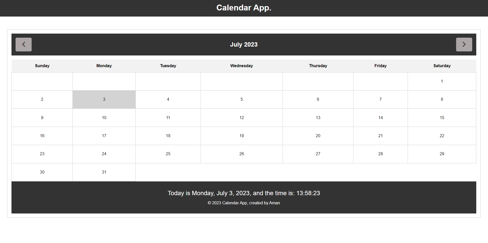

# Calendar App
A user-friendly calendar web application built with HTML, CSS, and JavaScript.

The Calendar App is a simple web application that allows users to view and navigate through a calendar, displaying the current month and year. 
It provides an intuitive interface for users to explore dates, view events, and manage their schedules efficiently.
# Calendar App

## Features

- **Month Navigation**: Users can easily navigate between months using the "Previous Month" and "Next Month" buttons.
- **Dynamic Calendar**: The calendar dynamically generates and updates the dates based on the selected month and year.
- **Current Date Highlighting**: The current date is highlighted to provide a visual cue to the user.
- **Date Selection**: Users can select specific dates to view or interact with events.
- **Time Display**: The app displays the current day, date, and time at the bottom, providing users with real-time information.
- **Responsive Design**: The app is designed to be responsive, ensuring a seamless experience on different devices and screen sizes.

## Usage

1. Clone the repository: `git clone https://github.com/AMAN-ARABZADEH/calendar-app.git`
2. Open the `index.html` file in a web browser.
3. Use the "Previous Month" and "Next Month" buttons to navigate through different months.
4. Click on a specific date to interact with events or view more details.

## Link:
- [Calendar App](https://amanarab.netlify.app/calender.html).
## Contributing

Contributions are welcome! If you have any ideas, improvements, or bug fixes, feel free to submit a pull request or open an issue.

## Sources

This project was inspired by the following resources:

- [Building a Calendar with Pure JavaScript](https://medium.com/@nitinpatel_20236/challenge-of-building-a-calendar-with-pure-javascript-a86f1303267d)
- [How to Design a Simple Calendar using JavaScript](https://www.geeksforgeeks.org/how-to-design-a-simple-calendar-using-javascript/)

## Acknowledgements

The Calendar App was developed by [Aman Arabzadeh](https://github.com/AMAN-ARABZADEH).
## License

This project is licensed under the MIT License. See the [LICENSE](LICENSE) file for details.

---

Enjoy using the Calendar App! We hope it helps you stay organized and manage your schedule effectively. If you have any feedback or questions, please don't hesitate to reach out.

